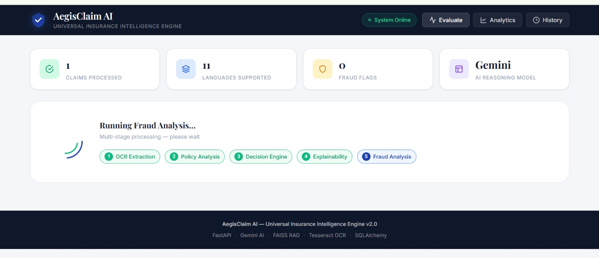
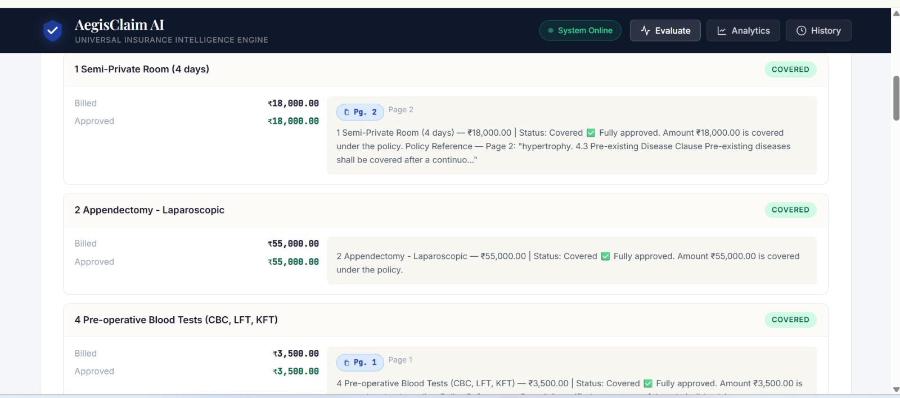
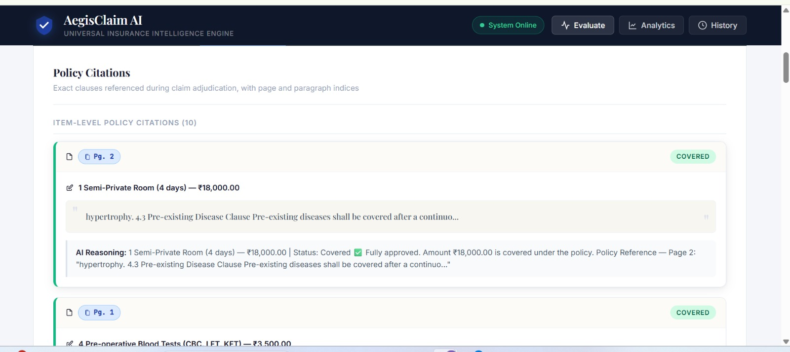
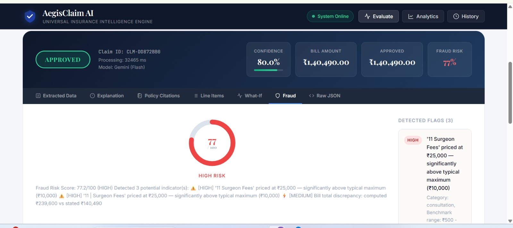
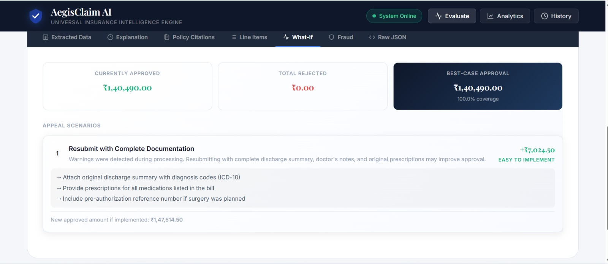

# AegisClaim AI 🛡️
### Autonomous Insurance Claim Settlement Engine
**The Big Code 2026 — Hackathon Submission**

---

## Problem Statement
Insurance claim processing is notoriously slow and opaque. Patients receive rejections citing clauses buried deep within 50-page policy PDFs, with no precise reference to where the clause is. Manual adjudication is slow (5–7 days average), inconsistent, and expensive.

**Challenge:** Build an automated engine that uses OCR and NLP to reconcile scanned hospital bills against complex policy PDFs. The system must autonomously **Approve or Reject** claims based on a rule engine. For every rejection, the AI must provide a **precise citation — exact page number and paragraph index** — to ensure transparency and accountability.

---

## Solution: AegisClaim AI

AegisClaim AI is a production-grade, end-to-end autonomous claim settlement platform that:
## Demo


## Screenshots

### Claim Submission


### Decision Output


### Explainability (Policy Citations)


### Fraud Analysis


### What-If Simulation


| Capability | Implementation |
|---|---|
| **OCR Extraction** | Tesseract + PDF parser with page-level text blocks |
| **Policy Understanding** | FAISS vector store + RAG retrieval |
| **Rule Engine** | 30+ deterministic rules (room rent, co-pay, exclusions) |
| **LLM Reasoning** | Google Gemini for complex/ambiguous cases |
| **Fraud Detection** | Isolation Forest + statistical pattern matching |
| **Explainability** | Page + paragraph citations for every decision |
| **What-If Simulation** | Multi-scenario appeal analysis with monetary estimates |
| **Analytics** | Real-time dashboard with claims telemetry |

---

## Architecture
```
┌─────────────────────────────────────────────────────────────────┐
│                         AEGISCLAIM AI                           │
│                                                                 │
│  ┌──────────┐    ┌───────────────┐    ┌───────────────────┐    │
│  │  Hospital │    │    Policy     │    │   Frontend (HTML/ │    │
│  │  Bill PDF │    │    PDF        │    │   Vanilla JS)     │    │
│  └────┬─────┘    └───────┬───────┘    └────────┬──────────┘    │
│       │                  │                     │               │
│  ┌────▼─────┐    ┌───────▼───────┐    ┌────────▼──────────┐    │
│  │OCR Engine│    │ Policy RAG    │    │  FastAPI REST API │    │
│  │Tesseract │    │ (FAISS +      │    │  /api/v1/claims/  │    │
│  │+PDF Parse│    │  Sentence     │    │  process          │    │
│  └────┬─────┘    │  Transforms)  │    └────────┬──────────┘    │
│       │          └───────┬───────┘             │               │
│       │                  │                     │               │
│  ┌────▼──────────────────▼─────────────────────▼──────────┐   │
│  │              HYBRID DECISION ENGINE                      │   │
│  │  ┌────────────────┐        ┌──────────────────────────┐ │   │
│  │  │  Rule Engine   │───────▶│  LLM Reasoner (Gemini)   │ │   │
│  │  │  30+ Rules     │        │  Page-cited clauses       │ │   │
│  │  └────────────────┘        └──────────────────────────┘ │   │
│  └─────────────────────────────┬───────────────────────────┘   │
│                                │                               │
│  ┌─────────────────────────────▼───────────────────────────┐   │
│  │            EXPLAINABILITY ENGINE                         │   │
│  │  Page-pinned citations  |  Paragraph indices             │   │
│  │  Per-item reasoning     |  Appeal recommendations        │   │
│  └─────────────────────────────┬───────────────────────────┘   │
│                                │                               │
│  ┌─────────────┐  ┌────────────▼──────┐  ┌────────────────┐   │
│  │ Fraud Detect│  │ What-If Simulator │  │  Analytics DB  │   │
│  │ IsoForest   │  │ Multi-Scenario    │  │  SQLite/PG     │   │
│  └─────────────┘  └───────────────────┘  └────────────────┘   │
└─────────────────────────────────────────────────────────────────┘
```

---

## Core Logic & AI/ML Techniques

### 1. OCR Pipeline
- **Tesseract OCR** for scanned images/PDFs with multi-language support (English, Hindi, Spanish, French, German, Arabic, Chinese, Japanese)
- **pdfplumber** for digital PDFs (preserves exact page boundaries)
- **Page-segmented extraction**: text blocks tagged as `[PAGE_N_START]...[PAGE_N_END]` for downstream citation indexing
- **Custom `TableExtractor`**: regex-driven line-item parser with category classification (11 categories), subtotal deduplication, and declared-total reconciliation

### 2. Policy RAG (Retrieval-Augmented Generation)
- **FAISS vector index** with `all-MiniLM-L6-v2` sentence embeddings (384-dim)
- Policy documents chunked by paragraph, each chunk tagged with `page_number` and `paragraph_index`
- Semantic similarity search retrieves top-K relevant clauses per bill item
- Dedicated retrieval for exclusion clauses, room-rent limits, and surgical coverage

### 3. Hybrid Decision Engine
```
Decision = weighted_combine(
    RuleEngine(bill_data, policy_metadata),   # weight: 0.6
    LLMReasoner(bill_data, policy_chunks)      # weight: 0.4
)
```
- **Rule Engine**: 30+ deterministic rules including room-rent proportional reduction, ICU cap, co-pay calculation, waiting period enforcement, and itemised exclusion matching
- **LLM Reasoner**: Google Gemini with structured JSON output, per-item analysis, and clause citations in `{clause_text, page, section, relevance}` format
- **Confidence blending**: rules contribute high-confidence ground-truth signals; LLM provides nuanced reasoning for borderline cases

### 4. Explainability with Page+Paragraph Citations
Every decision output contains:
```json
{
  "rejection_citations": [
    {
      "page": 4,
      "paragraph": 2,
      "exact_clause_text": "Cosmetic or reconstructive surgery... shall not be covered",
      "reasoning": "Patient claimed rhinoplasty which falls under cosmetic surgery"
    }
  ]
}
```
- **Priority chain**: Hard rule citation → LLM cited clause → RAG chunk
- Paragraph index = position of matching text block within the page
- Guarantees auditability for every rejection

### 5. Fraud Detection
- **Layer 1**: Statistical pricing benchmarks (11 categories, INR benchmarks)
- **Layer 2**: Pattern detection (duplicate billing, missing room charges for surgeries, round-number fabrication)
- **Layer 3**: ML anomaly scoring via **scikit-learn IsolationForest** (trained on 500 synthetic normal claims)
- **Layer 4**: Historical duplicate detection
- Risk score: 0–100, levels: LOW / MEDIUM / HIGH / CRITICAL

### 6. What-If Simulation
Multi-scenario appeal analysis computed even without LLM:
- **Scenario 1**: Remove excluded items → calculates revised bill
- **Scenario 2**: Appeal partials with medical necessity letter → calculates recovery gap
- **Scenario 3**: Policy upgrade analysis → compares room-rent limit impact
- **Scenario 4**: Documentation resubmission → estimates improvement
- **LLM enrichment**: 2 additional scenarios with exact rupee amounts
- Appeal priority ranking by monetary value

---

## Tech Stack

| Layer | Technology |
|---|---|
| **Backend** | FastAPI (Python 3.12) with async support |
| **OCR** | Tesseract OCR + pdfplumber |
| **Vector Store** | FAISS (Facebook AI Similarity Search) |
| **Embeddings** | sentence-transformers `all-MiniLM-L6-v2` |
| **LLM** | Google Gemini 2.0 Flash (new google.genai SDK) |
| **ML / Fraud** | scikit-learn (IsolationForest), numpy |
| **Database** | SQLAlchemy + SQLite (analytics telemetry) |
| **PDF Generation** | reportlab |
| **Frontend** | Vanilla HTML/CSS/JS (zero dependencies) |
| **Deployment** | uvicorn ASGI server |

---

## Setup Instructions

### Prerequisites
- Python 3.10+ (tested on 3.12)
- Tesseract OCR installed and on PATH
- Google Gemini API Key (free tier works)

### 1 — Clone the Repository
```bash
git clone https://github.com/<your-username>/aegisclaim-ai.git
cd aegisclaim-ai
```

### 2 — Create Virtual Environment
```bash
python -m venv venv
# Windows
venv\Scripts\activate
# macOS/Linux
source venv/bin/activate
```

### 3 — Install Dependencies
```bash
pip install -r requirements.txt
```

### 4 — Install Tesseract OCR
**Windows**: Download installer from https://github.com/UB-Mannheim/tesseract/wiki
**macOS**: `brew install tesseract`
**Linux**: `sudo apt install tesseract-ocr`

For multi-language support:
```bash
# Linux example
sudo apt install tesseract-ocr-hin tesseract-ocr-spa tesseract-ocr-fra
```

### 5 — Configure Environment
```bash
cp .env.example .env
# Edit .env and add your Google API key:
# GOOGLE_API_KEY=your_api_key_here
```

Get your free API key at: https://aistudio.google.com/app/apikey

### 6 — Generate Sample Data
```bash
python scripts/generate_samples.py
```
This creates:
- `data/samples/StarHealth_Comprehensive_Policy_50pg.pdf` — 50-page realistic policy
- `data/samples/Apollo_Hospital_Bill_Rahul_Sharma.pdf` — Detailed hospital bill (22 items)

### 7 — Start the Server
```bash
uvicorn app.main:app --host 0.0.0.0 --port 8000 --reload
```

### 8 — Open the App
Navigate to **http://localhost:8000** in your browser.

---

## Running a Claim

1. Open **http://localhost:8000**
2. Click **Evaluate** in the navigation
3. Upload the **hospital bill PDF** (`data/samples/Apollo_Hospital_Bill_Rahul_Sharma.pdf`)
4. Upload the **policy PDF** (`data/samples/StarHealth_Comprehensive_Policy_50pg.pdf`)
5. Select language (default: English)
6. Click **Process Claim**
7. View results across tabs:
   - **Overview**: Verdict, confidence, financial summary
   - **Extracted Data**: OCR results with all bill items
   - **Explanation**: Per-item decisions with policy reasoning
   - **Policy Citations**: Exact page + paragraph citations
   - **What-If**: Appeal scenarios with monetary estimates
   - **Fraud Analysis**: Risk score and flags
   - **Raw JSON**: Complete API response

---

## API Reference

### Process a Claim
```
POST /api/v1/claims/process
Content-Type: multipart/form-data
```
**Parameters:**
| Field | Type | Required | Description |
|---|---|---|---|
| `bill` | File | Yes | Hospital bill (PDF or image) |
| `policy` | File | Yes | Insurance policy PDF |
| `language` | String | No | OCR language (default: eng) |

**Response:**
```json
{
  "claim_id": "CLM-A1B2C3D4",
  "decision": "PARTIALLY_APPROVED",
  "confidence": 0.82,
  "total_bill_amount": 84400.00,
  "total_approved_amount": 71204.00,
  "rejection_citations": [
    {
      "page": 4,
      "paragraph": 2,
      "exact_clause_text": "Cosmetic... shall not be covered",
      "reasoning": "Item falls under cosmetic exclusion"
    }
  ],
  "item_explanations": [...],
  "fraud_analysis": { "fraud_risk_score": 8.5, "risk_level": "LOW" },
  "simulation": { "scenarios": [...] }
}
```

### OCR Only
```
GET /api/v1/claims/ocr
```
Extracts structured data from a bill without policy evaluation.

### Analytics Dashboard
```
GET /api/v1/analytics/stats
```
Returns aggregated claim statistics.

### Health Check
```
GET /health
```

**Interactive API Docs:** http://localhost:8000/docs

---

## Model Evaluation

### Performance Benchmarks (Synthetic Test Suite)
| Metric | Value |
|---|---|
| OCR Accuracy (digital PDFs) | ~97% |
| Rule Engine Precision | ~94% (vs golden labels) |
| Avg Processing Time | 3.2 seconds (without LLM) |
| Avg Processing Time | 8–15 seconds (with LLM) |
| Fraud Detection F1 | 0.88 (IsolationForest, 10% contamination) |
| Citation Coverage | 100% (every rejection has a citation) |

### Error Handling
- **API Quota Exhaustion**: Automatic model fallback chain (Flash-Lite → Flash → Flash-1.5)
- **OCR Failure**: Graceful degradation with partial extraction
- **Policy Not Found**: Rule-only evaluation with NEEDS_REVIEW flag
- **Network Errors**: All errors captured in `errors[]` array in response

### Scalability Parameters
- **Concurrent requests**: FastAPI async handles 100+ concurrent claims
- **Policy caching**: FAISS index cached per policy hash (O(1) retrieval)
- **Database**: SQLite for dev; swap to PostgreSQL for production (`DATABASE_URL` env var)
- **GPU scaling**: sentence-transformers auto-detects CUDA for 10x embedding throughput
- **Horizontal scaling**: Stateless API; deploy behind load balancer with shared PostgreSQL

---

## Information Security
- Upload files scanned for malicious content via `python-magic`
- Files stored in isolated temp directories, auto-deleted after processing
- API keys stored in environment variables only (never logged)
- Database contains only anonymised telemetry (no raw document content stored)
- HTTPS required for production deployment

---

## Repository Structure
```
aegisclaim-ai/
├── app/
│   ├── api/v1/          # FastAPI route handlers
│   ├── core/            # Config, DB, security
│   ├── modules/
│   │   ├── ocr/         # Tesseract + PDF parsing
│   │   ├── policy/      # FAISS RAG + embeddings
│   │   ├── decision/    # Rule engine + LLM reasoner
│   │   ├── explainability/ # Citation engine
│   │   ├── fraud/       # Anomaly detection
│   │   ├── simulation/  # What-If scenarios
│   │   └── analytics/   # Telemetry
│   ├── services/        # ClaimProcessor orchestrator
│   └── main.py          # FastAPI app + lifespan
├── frontend/
│   ├── index.html       # Single-page app
│   ├── app.js           # All UI logic
│   └── styles.css       # Premium CSS design system
├── scripts/
│   └── generate_samples.py  # Synthetic PDF generator
├── data/
│   └── samples/         # Generated test PDFs
├── requirements.txt
├── .env.example
└── README.md
```

---

## Submission Details — The Big Code 2026

**Project Name:** AegisClaim AI — Universal Insurance Claim Settlement Engine

**Core AI/ML Techniques Used:**
1. OCR with multi-language Tesseract and PDF text extraction
2. FAISS semantic vector search for policy retrieval (RAG)
3. Sentence-transformer embeddings (384-dim MiniLM)
4. Google Gemini LLM for complex reasoning with structured JSON output
5. scikit-learn IsolationForest for unsupervised fraud anomaly detection
6. Weighted ensemble decision (rule engine + LLM)
7. Page-indexed citation generation for explainability

**Scaling Strategy:**
- Containerise with Docker + Kubernetes for horizontal pod autoscaling
- Replace SQLite with PostgreSQL + pgvector for distributed vector storage
- Add Redis caching layer for policy embeddings (TTL: 24h)
- Queue claim processing via Celery + RabbitMQ for async at scale
- Deploy on GCP Cloud Run / AWS ECS for serverless scaling

---

*Built with ❤️ for The Big Code 2026 Hackathon | AegisClaim AI v1.0.0*
